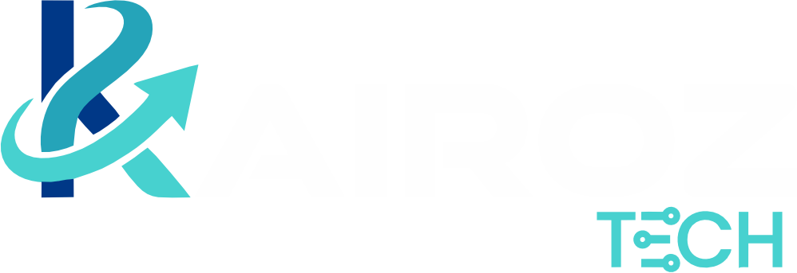

# Kairoz: Engenharia com Propósito

  

## O Conceito Kairoz
No grego antigo, *Kairós* representa o momento oportuno, o tempo qualitativo. A **Kairoz** nasceu para entregar tecnologia exatamente nesse ponto: onde a oportunidade de mercado encontra a maturidade técnica.

## O que fazemos
Projetamos e desenvolvemos ecossistemas digitais de alta complexidade. Não apenas escrevemos código; construímos ativos tecnológicos robustos que garantem a sustentabilidade e a escalabilidade do seu negócio.

### 💎 Nossos Pilares

* **Precisão:** Garantimos a integridade absoluta dos dados e a segurança da informação.
* **Oportunidade:** Entregamos inovação no tempo exato em que seu negócio precisa escalar.
* **Sinergia:** Criamos tecnologia que conecta pessoas e otimiza o desenvolvimento humano.

---

## Metodologia de Trabalho
Nosso fluxo foi desenhado para eliminar gargalos e garantir previsibilidade total:

1.  **Imersão & Diagnóstico:** Mapeamos profundamente as dores da operação antes da primeira linha de código.
2.  **Desenvolvimento Ágil:** Ciclos curtos (Sprints) com visibilidade total e entregas incrementais.
3.  **QA de Alta Fidelidade:** Protocolos rigorosos de testes que asseguram performance e estabilidade.
4.  **Escalabilidade Contínua:** Suporte e monitoramento focado no crescimento acelerado da base de usuários.

## Stack Tecnológica
Dominamos as ferramentas mais modernas do mercado para entregar performance nativa e baixa latência:
* **Backend:** Java (Spring Boot), Python, Node.js.
* **Cloud & Dados:** Amazon Web Services (AWS) e MySQL.
* **Frontend:** React e interfaces de alta fidelidade.

---

## Parcerias que Geram Valor
A Kairoz atua como o braço tecnológico de empresas que buscam transformar desafios operacionais em diferenciais competitivos. 

> "Nossa missão é otimizar a gestão do tempo e do conhecimento, transformando dados em ferramentas que priorizam o humano."

---

## Vamos Conversar?
Estamos prontos para ouvir sobre seu projeto e ajudar sua empresa a alcançar o próximo nível.

* **WhatsApp:** [Link de Contato]
* **E-mail:** contato@kairoz.com.br
* **LinkedIn:** [Link da Empresa]

---

  <strong>Kairoz</strong> - Tecnologia sob medida. No tempo da sua oportunidade.

